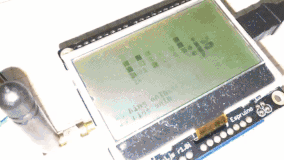
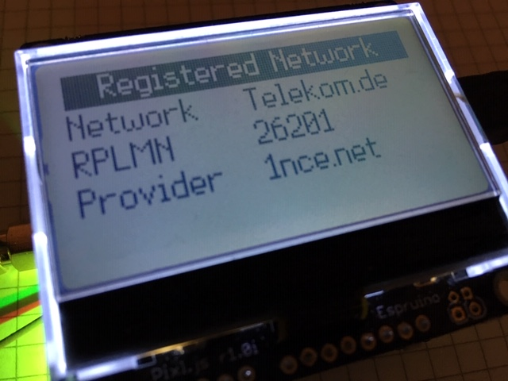
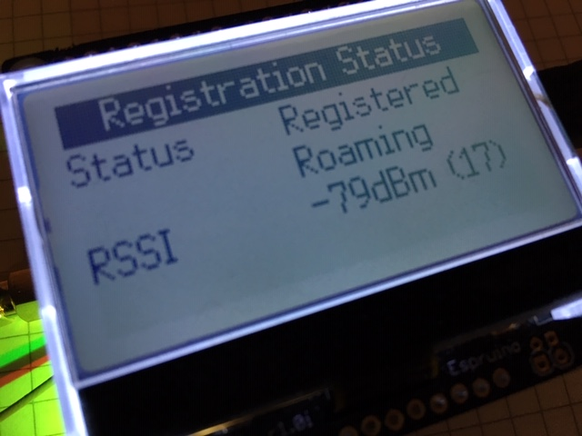
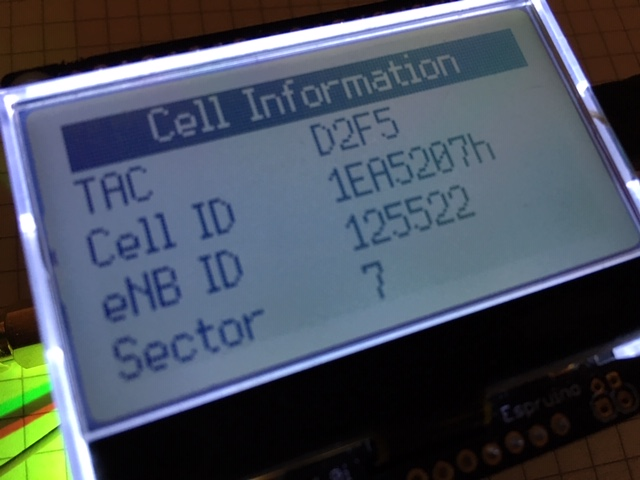
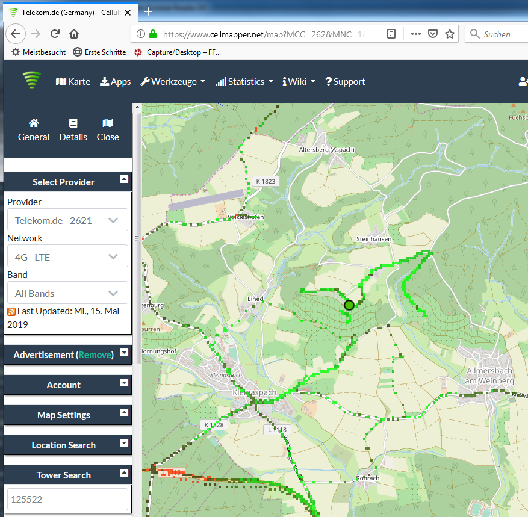
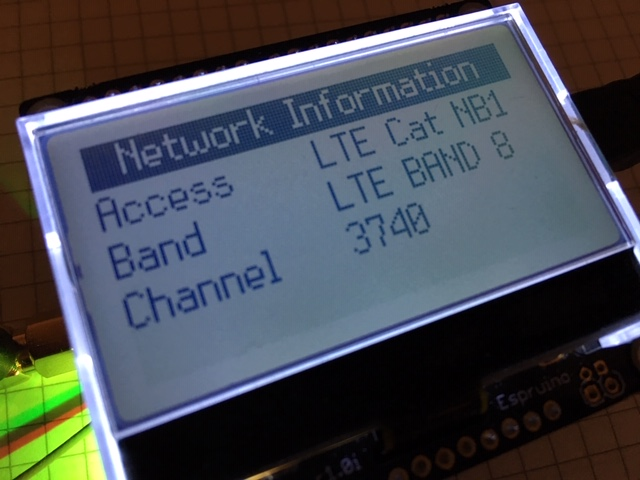
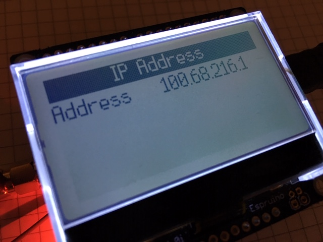
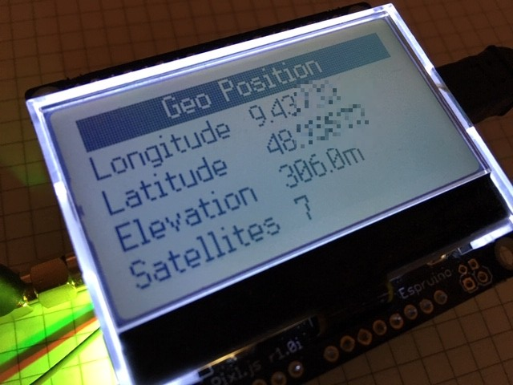
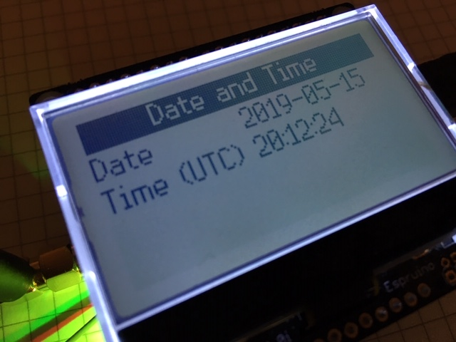

# NB-IoT Explorer
Explore [Narrowband IoT (NB-IoT)](https://en.wikipedia.org/wiki/Narrowband_IoT) 
Radio Networks in a comfortable, user-friendly way.



In this project, two extremely powerful components come together: 

The [Espruino Pixl.js](https://www.espruino.com/Pixl.js) with its built-in JavaScript
interpreter is easy to program. The (native) [Espruino Web IDE](https://www.espruino.com/Web+IDE) lets you transfer 
the code to the device using Bluetooth LE, so there isn't even a USB cable needed to connect the computer with the device.
The Espruino Pixl.js device has a large LCD display with 128x64 pixels, and four buttons on each corner of the 
display allow highly interactive applications.

The [Quectel BG96 module](https://www.quectel.com/product/bg96.htm) module on the NB-IoT Shield provides multi-band support, 
so it can be used in many different radio networks all around the world. 
The NB-IoT Shield provides direct access to the serial interface of the BG96 module,
so you also can try things out using a FTDI cable, which can be useful if you want to do firmware updates. The BG96 module
provides a wide range of AT commands for a lot of purposes, and even provides high-level protocol implementations
like HTTPS and MQTT, which can be very useful for IoT applications. Additionally, it provides geo-positioning by
its embedded [GNSS](https://en.wikipedia.org/wiki/Satellite_navigation) chip.
 
## Material
* [Espruino Pixl.js](https://shop.espruino.com/pixljs) - Bluetooth microcontroller programmable in JavaScript with 
  built-in LCD display and Arduino footprint.
* [Dragino Nb-IoT Shield QG96](https://wiki.dragino.com/index.php?title=NB-IoT_Shield) - Arduino shield that hosts 
  a [Quectel BG96 module](https://www.quectel.com/product/bg96.htm). This module **supports multiple bands** for NB-IoT. 
  Except NB-IoT, It also support LTE Cat M1 and EGPRS.
* Micro USB cable for power supply  
* Optional: GNSS Active Patch Antenna
* Bluetooth Low Energy Dongle for your computer, if it not already supports BLE natively.

## Preparation
* Get yourself familiar how to connect the (native) Espruino Web IDE with the Espruino Pixel.js board via Bluetooth LE.
* Play around with the code examples for the Pixl.js.
* The 5v pin on the on the Pixl.js will be used to power the NB-IoT shield. 
  There is a solder jumper near the LCD connector labelled "3.3 5V Vin". Short Vin to 5v - the 5v pin will be connected 
  to 5v (when connected via USB) or whatever the voltage provided on Vin is.
  Read more about shield power at https://www.espruino.com/Pixl.js#shield-power.
  (Using the 3.3v at the output of the power regulator does not provide enough power when the BG96 starts to transmit).
* If you are good in soldering, you can consider to physically remove the big square socket connector at the reverse side
  of the NB-IoT shield, because it is in the way when the Pixl.js and NB-IoT shield are connected.
* Connect the Pixl.js with the NB-IoT shield by its Arduino connectors.
* Optionally: Attach the GNSS Patch Antenna.  
* Get yourself a SIM card suitable for NB-IoT and insert it into the SIM card holder of the NB-IoT shield.
  Note: The cut corner of the SIM card has to point in your direction when inserting it. If you don't take attention,
  then there is a chance that you insert the SIM card in the wrong orientation.
* Load the JavaScript code from https://github.com/wklenk/nb-iot-explorer into the (native) Espruino Web IDE. 
* Check for the JSON structure named connection_options and provide the appropriate settings for the NB-IoT network
  provider of your choice.


    var connection_options = {
      band: "B8",
      apn: "iot.1nce.net",
      operator: "26201"
    };
  
* Turn on Minification in _Settings -> Minification_. Choose _Closure (online) - Simple optimizations_.
* Send the application to the Pixl.js.
* If you want to keep the application in the Pixel.js even after re-booting the Pixl.js, then save it to flash by typing 
  _save();_

```
     ____                 _
    |  __|___ ___ ___ _ _|_|___ ___
    |  __|_ -| . |  _| | | |   | . |
    |____|___|  _|_| |___|_|_|_|___|
             |_| espruino.com
     2v01 (c) 2018 G.Williams
    
    save();
    =undefined
    Compacting Flash...
    Calculating Size...
    Writing..
    Compressed 40000 bytes to 20601
    Running onInit()...
    Press RESET button on NB-IoT shield if onInit() was called interactively.
```    
* To connect to the NB-IoT network, press the RESET button on the NB-IoT shield now.
  This is not necessary when you boot the device. In this case, the NB-IoT shield will reset by its own.
  When the application detects that the BG96 module is ready for operation, it will flicker the background light
  of the LCD display 5 times.
* Now it is time to wait, as it may take seconds to a few minutes now for the BG96 module to manually register at the 
  NB-IoT radio network. The activity LED should flash in the rhythm "on-off-off-off" periodically to indicate network search.
* Once the BG96 module is connected, the splash screen on the LCD display will disappear, and other screens will
  appear. Use the two buttons on the corners of the right side of the display to cycle up/down trough these screens.    

## Screens
The button on the left top corner can be used to toggle the backlight of the LCD display.
Use the two buttons on the corners of the right side of the display to cycle up/down trough the following screens.

When taking the screenshots, a NB-IoT SIM card of provider [1nce.com](https://1nce.com) was used.

### Screen: Registered Network

Displays the name of the registered network.
The "Registered [Public Land Mobile Network](https://en.wikipedia.org/wiki/Public_land_mobile_network)" (RPLMN) is 
identified by a globally unique PLMN code, which consists of a MCC (Mobile Country Code) and MNC (Mobile Network Code).
The screenshot shows MCC 262 for Germany and MNC 01 for Deutsche Telekom.

### Screen: Registration Status

Displays the Network Registration Status and the received signal strength (RSSI).
On successful connection to the radio network, the status should be _Registered Home Network_ or _Registered Roaming_.

### Screen: Cell Information

Displays the two-byte tracking area code (TAC) in hexadecimal format, the 3 1/2 byte (28 bit) E-UTRAN cell ID in 
hexadecimal format, the eNB ID in decimal format (E-UTRAN cell id without 8 bit sector information) and the sector of 
the base station antenna.

This information can be used to look up the position of the base station tower in a map, 
with a service like https://www.cellmapper.net:

* Enter Provider. The input field behaves a little bit strange.
  If RPLMN for example is "26201", then you may need to enter "2621".
* Enter Network "4G - LTE"
* In Input Area "Tower Search", enter eNB ID and press Return



### Screen: Network Information

Displays network information such as the access technology selected, the selected band and the Channel ID.

### Screen: IP Address

The IP address assigned to the BG96 module in the address space applicable to the 
[PDP](https://en.wikipedia.org/wiki/GPRS_core_network#PDP_context).

### Screen: Geo Position
    
Displays the current geo position including Longitude, Latitude and Elevation, and the number of satellites received.

### Screen: Date and Time

Displays the current date and time in UTC.